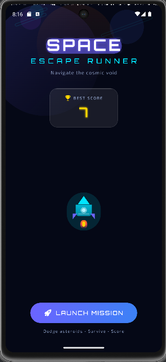
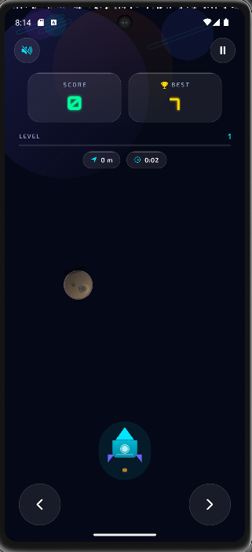
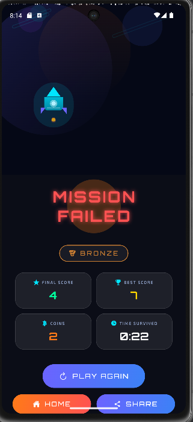

# 🚀 Space Escape Runner

<div align="center">

)

)

)

)

A futuristic arcade space game built using **React Native** and **Expo**.

Modern UI • Smooth Animations • High Performance • Responsive Design

</div>

---

# 📱 Screenshots

> Replace these images with screenshots from your own game.

| Home Screen | Gameplay | Game Over |

|-------------|-----------|-----------|

|  |  |  |

---

# 🎮 About The Game

Space Escape Runner is a fast-paced arcade game where the player pilots a spaceship through endless waves of falling asteroids.

The objective is simple:

- 🚀 Control the spaceship

- ☄️ Dodge incoming asteroids

- ⭐ Earn the highest score

- 🏆 Beat your previous high score

This version includes a complete futuristic UI redesign with modern animations and premium visual effects.

---

# ✨ Features

- 🚀 Futuristic Space UI

- 🌌 Animated Space Background

- ✨ Glassmorphism Design

- 🔥 Smooth UI Animations

- 💥 Particle Effects

- 🛰️ Modern HUD

- 🏆 High Score Saving

- 🎮 Responsive Controls

- 📱 Android Optimized

- ⚡ Fast Performance

---

# 🛠 Tech Stack

- React Native

- Expo SDK 56

- Expo Blur

- Expo Linear Gradient

- Expo Vector Icons

- AsyncStorage

---

# 📂 Project Structure

```

SpaceEscapeRunner

│

├── android

├── assets

├── src

│   ├── components

│   ├── constants

│   ├── hooks

│   └── screens

│

├── App.js

├── package.json

├── app.json

└── [README.md](http://README.md)

```

---

# 🚀 Installation

Clone the repository

```bash

git clone [https://github.com/RAJK2005/SpaceEscapeRunner.git](https://github.com/RAJK2005/SpaceEscapeRunner.git)

```

Open the project

```bash

cd SpaceEscapeRunner

```

Install dependencies

```bash

npm install

```

Run the project

```bash

npx expo start

```

Run on Android

```bash

npx expo run:android

```

---

# 🎯 Gameplay

- Move Left

- Move Right

- Avoid Asteroids

- Increase Your Score

- Beat Your Best Score

---

# 🔮 Future Improvements

- 🎵 Background Music

- 🔊 Sound Effects

- 🏅 Achievements

- 🪙 Coin System

- 🛒 Shop

- 🛡️ Power Ups

- 🌍 Global Leaderboard

- 🎯 Missions

- 🌠 Boss Levels

---

# 👨‍💻 Developer

## RAJ

React Native & Android Developer

GitHub

[https://github.com/RAJK2005](https://github.com/RAJK2005)

---

# ⭐ Support

If you like this project,

⭐ Star this repository on GitHub.

---

# 📄 License

This project is licensed under the MIT License.